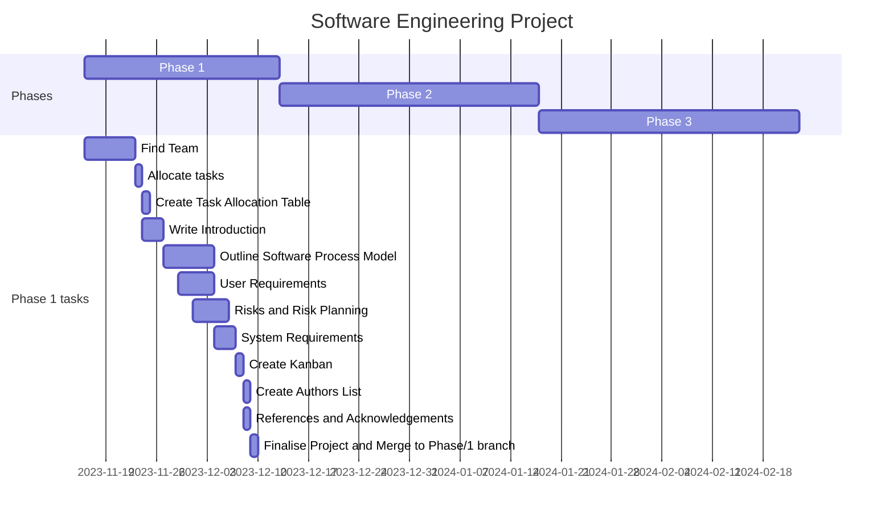

# Phase 1 - Requirements Engineering

## Gantt Chart

The gantt chart is used to aid with the timings of what should be done, and when. This shows the dates of each section graphically, showing how each of the individual elements relate to eachother.

## Kanban

Screenshot of the kanban while the project was in progress.
