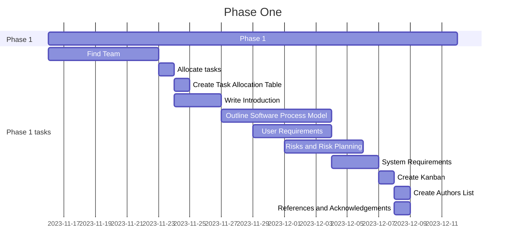

# Phase 1 - Requirements Engineering

## Contents
1.

## Table
| Name | Assignment |
|-----|-----| 
|[Denis](https://github.com/wheissmd) | Introduction // System Requirement
|[Wojciech](https://github.com/flock-of-jays)| Kanban // Gantt Chart
|[Maisha](https://github.com/maishkhan)| Content // Table // Reference
|[Reshmaa](http://github.com/reshma2005)| Glossary // Risk and Risk Planning
|[Sanjita](http://github.com/SanjiGre99)| User Requirement // Create Authors

## User Requirements definition

  

## User Requirements Definition

In this Library system, we have two types of users: Student User and Staff User. For the students and staffs to use the library system, there are some requirements that we are keeping in mind. These are Functional Requirements (What the system should do) and Non-Functional Requirements (Qualities of the Library System).

Functional Requirements for Staff Users: 
1.	Staff users can manage and update book information.
2.	Staff users have full access to the library system.
3.	Staff users can delete books from the system, with a confirmation prompt (Are you sure you want to delete this?) to ensure they are sure about the deletion.
4.	Staff users can view student’s balance.
5.	Staff users can check out books on behalf of students.

Functional Requirements for Student Users:

1.	Students can view their own account information within the library system.
2.	Students can see their own account balance.
3.	Students can pay their own balance within the library system.
4.	Students can loan laptops for 3 days, 7 days and 14 days.

Non-Functional Requirements for Staff and Student Users: 
1.	The system provides two factor authentication service to ensure secure authentication and authorisation for all users.
2.	The system has a complete guide for students on how to loan a laptop, how to buy books, borrow books etc.
3.	The system displays clear and informative prompts for deleting books to prevent data erasing and accidental deletions.
4.	The system maintains data privacy and security, prevent bugs, ensures the confidentiality of user information, including balances and payments. 
5.	The system has user-friendly and secure functionality for checking out books and processing payments.
6.	The system has a contact number and live chat option for students interacting directly with staff for any help.

## Gantt Chart

## Kanban

Screenshot of the kanban while the project was in progress

## Authors

- [SanjiGre99](https://github.com/SanjiGre99)
- [reshmaa2005](https://github.com/reshmaa2005)
- [maishkhanmaishkhan](https://github.com/maishkhan)
- [flock-of-jays](https://github.com/flock-of-jays)
- [wheissmd](https://github.com/wheissmd)

## References and Acknowledgements
1. 
2. Gantt Chart. [Online] Available at: https://mermaid.js.org/syntax/gantt.html
3. 