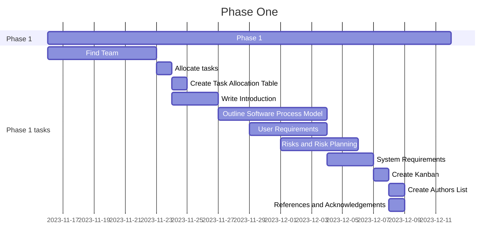

# Phase 1 - Requirements Engineering  
  
  ## Contents
- [Phase 1 - Requirements Engineering](#phase-1---requirements-engineering)
  - [Contents](#contents)
  - [Table](#table)
  - [Introduction](#Introduction)
  - [Software Process Model](#software-process-model)
    - [What is an Incremental Model](#what-is-an-incremental-model)
    - [Phases of Incremental Models](#phases-of-incremental-models)
    - [Using an Incremental Model](#using-an-incremental-model)
    - [Justification For Model Choice](#justification-for-model-choice)
   - [Risks and Risk Management](#Risks-and-Risk-Management)
   - [Glossary](#Glossary)
   - [User Requirements defination](#User-Requirements-defination)
   - [Authors](#Authors)
   - [Gantt Chart](#Gantt-Chart)
   - [kanban](#kanban)
   - [References and Acknowledgements](#references-and-acknowledgements)

## Table
| Name | Assignment |
|-----|-----| 
|[Denis](https://github.com/wheissmd) | Introduction // System Requirement
|[Wojciech](https://github.com/flock-of-jays)| Kanban // Gantt Chart
|[Maisha](https://github.com/maishkhan)| Content // Table // Software Processes Model // Reference
|[Reshmaa](http://github.com/reshmaa2005)| Glossary // Risk and Risk Planning
|[Sanjita](http://github.com/SanjiGre99)| User Requirement // Create Authors

## Introduction

A library system that needs to be capable of managing the users is required. Users need to be able to check out the books from the available stock and pay the over-due fees if they have them. Staff needs to be able to create and delete the users with a confirmaion prompt when removing a user and edit the list of available books. The IDs representing each user should be formated and stored in a specific way, that is described in "System Requirements and Specifications" section. Using IDs as a reference staff members should be able to access the full information about the user including their fullname, current books they hold, their unpaid over-due and history of their book borrowing.

The over-due fees should be capped at the borrowed books value and setted manually by staff and should increase by 10p every day of the book over-due date.

The major aspect of the system is security. Since users are expected to share their billing deails with the system it should focus on providing the data protection and the data leakage should not be possible. In order to achieve that special security measures, including protected authentification system, firewalls, constant bugfix update development must be in use. Deep description of the security measures can be found in "Risk Management" section.

The development strategy of the project is described by the chosen incremental development model. The reasons for this choice are described in the "Software Proces Model" section. Kanban was used to track the progress and assing people to solving the particular issues, the Kanban screenshot can be found in the "Kanban" section. 

## System Requirements and Specifications

The system requirements listed below are devided into functional and not functional. Functional requirements are the basic ones that allow system to work correctly and describe the functionality. Non-functional requirements despite not adding new features to the system, provides a safe and user friendly experience of using the system with low risks of acciential actions with consequences.

### Functional requirements

- Data Bases

    The system should include two data bases, one that contains the users' information and the other that contains the list of available books. Both data bases should be editable by staff members. When users access the system they should be able to choose the books they need to borrow and pay the fees in case of over-due via adding an online payment method.

    The users data base should be capable of storing at least 23000 users (The amount of students currently studying in University of Greenwich) with their details such as First and Second names, history of borrowed books and payments, account registration date and a user ID stored in a specific way:

    1. First part is composede of the initials of the user
    2. Second part is a randomly generated code of four numbers
    3. Third part is a randomly generated single letter

    The book database should be capable of storing at least 50000 books, where each book should have the information about the author, title, cover image, isbn number and synopsis as well as borrowing history, date of publication and date of adding it into the library, current status of availability. The book data base should also allow the multiple copies of the same book to be stored.

    The staff interaction with the system should allow them to change the status of the book from being available to being on loan with providing the user ID of the student loaning the book. The staff should also be able to add, edit or delete user details from the users data base and add and delete books from the books data base.

- Authentification system

    Authentification system should feature two different account classes: users and staff. These classes have different level of acess and the actions they can do using their accounts. The book can not be borrowed by staff, while non of the data bases (books and users) can be edited by user. In order to achieve that authentification system must be able to recognize staff accounts and separate them from users' accounts.

    The system's main purpose is to acceess the users' database and the passwords list and find the passwords corresponded to the user names and accounts when loging in. The password list should be incrypted in order to provide required level of safety and the system needs to be able to understand this encryption.
    
- Payment system

    Payment system won't be developed from scratch for the project. Like most of the web services this project will rely on the existing payment system (for example: Klarna) yet to be decided. The main requirement for the chosen payment system is security and the additional research of the security quality of different services is required.

### Non-Functional requirements

- Confirmation pop-ups

    In order to reduce the accidential actions with unwanted consequences a couple of actions in the system should be followed by pop-up windows requiring a confirmation. This should be applied on these actions:

    1. Editing or deleting the book from the books data base by a staff member
    1. Editing or deleting the user's details from the users data base by a staff member
    2. Returning a book by user
    3. Making a payment for the over-due by user

    Implementation of thse pop-ups significantly can significantly reduce the amout of accidentially deleted books, users and payments.

- User friendly interface

    User friendly interface should be implemented to encourage students to use the system rather than being unintuitive and pushing them to ignore the provided recources. The basic rules of keeping the interface user friendly that should be followed includes not creating overloaded interface with too much menus and buttons and keeping the sequence of actions to perform a particular task while interacting the system as short as possible.

- Mobile version of the web site

    Mobile version of the web site should be created in order to provide a better experence for users interacting with the system with their mobile phones. This version of the web-site should feature larger buttons that can be easily pressed on the small touch screen and larger font.

## Software Process Model

A software process model is a structured representation of the software development process. It describes the sequential and parallel activities that take place throughout the software development life cycle (SDLC). The process model serves as a roadmap for planning, stucturing, and controlling the process of developing an information system.

**1. Waterfall Model**

* Sequential and linear model.
* Progresses through defined phases such as requirement, design, implementation, testing, deployment, and maintenance.
  
**2. Agile Model**

* Emphasixes Fleibility, collaboration, and customer feedback.
* Incorporates risk assessment and adjusts the process as needed based on feedback and evalutio.

**3. Incremental Model**

* Breaks the system into small, maangeable parts or increments. 
* Each increment represents a portion of the system's funtionality and is developed separately.

**4. DevOps Model**

* Integrates development and operations to improve collaboration and productivity.
* Aims to automate the software delivery process and enhance communication between development and operations teams.

The choice of a software process model depends on various factors, including project requirments, organizational goals, and the nature of the software being developed. Different models have theirstrengths and weaknesses, and organizations may choose or tailor a model based on their specific needs and constraints. For this projects we have chosen the incremental model for the Library System.

### What is an Incremental Model 

The incremental model is a software paradigm for growth for big and complicated systems. It is built on the concept of adding new features, or increments, to an existing system rather than starting from scratch. The incremental model divides or breaks down software requirements into multiple stand-alone modules or increments in the SDLC (Softwre development life cycle). Once the moduloes have been partitioned, incremental development is carried out in steps, comprising all analysis, design, implementation, necessary testing or varification, and maintenance. The functionality of each stage is built on the fuctionality of the preceding stage, and this process is repeated until the software is complete.

The incremental model requires the development team to complete each incremental build as rapidly as feasible. The objects is to gradually offer a ductional product. Regular releases are part of the process, with each release reflecting an increase in functionality and quality.

### Phases of Incremental Models 

The phases of incremental models in the (SDLC) typically follow a pattern where the development processe is divided into smaller increments or modules. each increment goes through a set of common phases. While the specific names of the phases may very slightly based on the model and methodology being used, a general representation includes the following phases: 

***1. Planning:***
  
  * Define the overall project scope, objectives, and requirements.
  * identify the increments or modules that will be deveoped.
  * Plan the Schedule and resources for each increment.

***2. Requirements Analysis:***

* Gather and analyze the requirement for the specific increment.
*  Define the features and fuctionality that will be implemented in the current phase.

***3. Design:***

* Create a high-level design for the entire system, focusing on the features to be implemenred in the current increment.
* Break down the design into smaller components or modules.

***4. Implementation:***

* Develop the code for the features identified in the design phase.
* Coding is focused on the specific increment being worked on.

***5. Testing:***

* Conduct testing on the increment to ensure that the implemented features meet the specified requirements.
* Identify and fix any defects or issues found during testing.

***6. Integration:***

* Integration the current increment with previously developed increments.
* Varify that the integrated system functions as expected and that there are no conflicts between increments.

***7. Deployment:***

* Release the current increment to end-users or stakeholders for evalution.
* Gather feedback on the implemented features.

***8. Feedback and Evalution:***

* Collect feedack from users and stakeholders.
* Evalute the success of the implemented features.
* Use feedback to make improvements and adjustments for the next increment.

These phases may vary in terminology or specific activities depending on the chosen incremental model. Additionally, some incremental models may incorperate a feedback loop where each increment informs the planning and development of subsequent increments. The key is that the development process is broken down into manageable parts, allowing for flexibility, early deliveries, and adaptation to changing requirements.

### Using an Incremental Model

The incremental Model in software development offers several benifits that contribute to a more flexible and adaptive approach to building software. Some of the additional of using an incremental model include:

**1. Reduced Risk of Project Failure:**

* The incremental model allows for the detection and correction of errors and issues at an early stage, reducing the risk of major project failure.
* Early identification of problems makes it easier to address and mitigate potential risks.

**2. Higher Visibility and Control**

* Projects progress is more visible and measurable with the completion of each increment.
* This provides betetr control over the development process and allows for early iddentification and resolution of issues.

**3. Easier Integration and testing:**

* Incremental development simplifies integration and testing since eacfh increment is a funtional subset of the complete system.
* Integration and testing efforts are distributed over time rather than being concentrated at the end of the development process.

**4. Better Resource Allocation:**

* Resources can be allocated incrementally based on the current priorities and requirements.
* Teams can be assigned to work on specific increments, optimizing resource utilization.

**5. Enhance Team Collaboration:**

* Communication and coordination are streamlined, promoting a collaborative development environment.
* Teans can collaborate more effectively as they work on smaller, well-defined tasks.

**Pros of Incremental Model:**

1. Frequent User Feedback: Continuous feedback from users allows for the refinement of requirements and ensures that the final product aligns with user expectations.
2. Early Delivery of Partial Functionality: Users get to see and use of the system early in the development process, providing tangible benefits sooner
3. Higher Stakeholder Confidence: Regular delivery of increments builds stakeholder confidence as they see continuous progress and have oppurtunities to provide input.
4. Meeting Goals: Once the requirements are mapped out, all software goalsnand objectives can be sarisfied completely through incremental development.

**Cons of Incremental Model:**

1. **Potential for Overlapping Features:** Without proper planning, there may be a risk of overlapping features between increments, leading to redundancy.
2. **Complexity in tracking:** Tracking and managing the progress of multiple increments can become complex, especially in large projects.
3. **Mangement Overhead:** Managing multiple increments may increase projects management overhead, requiring careful planning and coordination.
4. **Possibility for Incomplete Suystem Integration:** If not managed properly, there is a risk of incomplete system integration, leading to issues when integrating all increments.
  

### Justification For Model Choice

The Incremental Model is a suitable choice for developing a library system due to its ability to involve users early in the development process and gather continuous feedback. Libraries often have diverse user needs, and incremental development allows for the phase implementation of various modules, such as cataloging, circulation, and user management. This approach aligns well with the evolving requirements of libraries, providing flexibility to adapt to changing technologies and services. Additionally, the model aids in risk management by accuracy and reliability of data in a library system. For libraries with critical operational features, the Incremental model allows for a faster time-to-market, enalbling the use of essential funtionalities without waiting for the entire system to be completed. Resource optimization is facilitated by allocating resources based on feature priority, and the model support smoother intregation with existing systems. The incremental approach also allows for phased training and adoption, easing the transition for library staff and users. Effective project management and communication are essential for the successful implementation of the incremental model in the development of a library system.

In conclusion, while the incremental model offers benefits such as early delivery, user feedback, and flexibility, it requires careful planning and management to mitigate itspotential drawbacks. The suitability of this model depends on the specific characteristics and requirements of the software development project.

## Risks and Risk management
### 1. Data Vulnerability
- Data can be easily accessed, changed, or stolen if there are weak security measures in place which doesn’t allert us while the usage. 

- Risk Management: Improving the security method by installing strong data encryption methods, authorised access controls, frequent data back up, and conduct vulnerability assessments in order to find and address any potential vulnerabilities. 
(National Institute of Standards and Technology, 2017). Computer Security Resource Center).

### 2. System Malfunction
- There is a risk of system failure or malfunction because of the software bugs, viruses, hardware disfunction, or compatibility issues.

- Risk Management: Running a full analysis, testing and quality assurance processes to identify and fix any software or hardware issues. Frequent update and maintenance of the system components to ensure the optimal system performance. 
(Gary Stoneburner, Alice Goguen, and Alexis Feringa  ,Computer Security Division Information Technology Laboratory National Institute of Standards and Technology Gaithersburg, MD 20899-8930, July 2002)
### 3. Inadequate User Training
- Clients may not be enough prepared to utilize the library framework, prompting blunders, information misfortune, or security breaks.

- Risk Management: 
Scheduling regular training programs and teaching them to use the recourses and supports. Must ensure their skills and knowledge about the system so that there will be no more issues in the future. Giving them chance to explain and getting feedback from the users and providing the essential upgraded tasks to skill them up (Ilia Sotnikov ,Published: August 2, 2018).
### 4. Integration Challenges
- Further developing the library framework with other existing frameworks or data sets might present difficulties, prompting similarity issues or information irregularities.  

- Risk Management: Direct intensive examination and wanting to recognize potential combination challenges. Foster a movement plan that incorporates information approval and compromise processes. Team up intimately with partners and IT offices to guarantee smooth combination. 
 ( Breen, D., Monahan, B., Cullen, N., & O'Sullivan, D. (2008). Methods and Tools for Managing the Risk in Systems Integration. IT Professional, 10(4), 20-26. DOI: 10.1109/MITP.2008.86)
 
### 5. Security Breaches
- There is a risk of unauthorized access, hacking, or malware attacks on the library system and its associated networks.
- Risk Management: Carry out far reaching safety efforts like firewalls, interruption recognition frameworks, and antivirus programming. Consistently update security fixes and guarantee that all product and frameworks are modern. Lay out episode reaction plans and lead ordinary security reviews. 
(U.S. Department of Commerce Wilbur L. Ross, Jr., Secretary)

### 6.  Hardware Glitch 
- This hazard alludes to the chance of the actual parts of the library framework (like servers, PCs, or organization hardware) neglecting to work appropriately, bringing about framework free time and potential information misfortune.
 
- Risk management-  Routinely review and keep up with the equipment to distinguish any potential issues ahead of time. Execute overt repetitiveness measures, for example, reinforcement servers or Strike stockpiling to limit the effect of equipment disappointment. Moreover, make a far reaching calamity recuperation plan that incorporates reinforcements, offsite capacity, and a reasonable methodology to reestablish the framework rapidly.

### 7. Data unfound or loss 
- This hazard involves the misfortune or inaccessibility of critical information put away in the library framework, which can happen because of unintentional erasure, framework misfires, or digital assaults.
 
- Risk management-  Consistently reinforcement all information and guarantee the reinforcements are put away safely. Execute severe access controls to forestall unapproved alterations or erasures. Use encryption strategies to get delicate information and consider having numerous duplicates of information put away in geologically assorted areas.

### 8. Programming bugs and errors
- This chance alludes to blunders or glitches in the product utilized inside the library framework, possibly prompting framework crashes, information debasement, or compromised security.
 
- Risk management-  Lead thorough testing and investigating during the advancement stage to recognize and wipe out programming bugs. Use robotized testing devices and execute normal programming updates and fixes to address distinguished weaknesses. Moreover, follow secure coding practices to limit the gamble of presenting programming bugs. 

### 9. Changing requirements or scope creep
  
- Risk Management : In order to reduce the possibility of scope creep, clearly identify the project goals and scope from the outset. Retain regular lines of communication with interested parties to quickly address any additions or modifications to the criteria. To guarantee effective administration and control, track and document every change.

## Glossary 
### 1. Agile model 
Agile is a methedology of project management and software  development that focuses on iteration. This approach allows teams to deliver value to customers in a faster and more efficient manner. Instead of depending on a single large launch, an agile team focuses on delivering smaller, easily digestible increments of work. (Rahul Arun, simpli learn blog, 2 November 2023)

### 2. DevOps model 
DevOps overcomes any issues between programming improvement and activities. This approach cultivates cooperative energy among improvement and tasks groups, empowering a cooperative and shared liability culture. It is a computer programming strategy that means to flawlessly incorporate the endeavors of the two groups.

### 3.  Gantt chart 
It is a chart that is commonly used for the project management which contains a time scale and the list of activities, it is used for noting down the time period and allocating the tasks. 

### 4. Incremental model:
This model is a course of programming improvement where the requirements  are separated into various independent modules of programming improvement cycle. It is finished in strides from examination plan, execution, testing/confirmation, support. ( Matthew Martin, 28 October 2023 @Guru99)

### 5. Kanban
It is a popular frame work that helps us to work for implementing agile and many other software which allows us to work on it at any time. 

### 6.Software Process Model 
  
It’s the methodology of dividing the software development work into the distinct phase in order to improve the design, product and project management.  This defines tasks which is to be performed, the input, output and the processing of each task, the conditions of the task and the sequence of the task. 
  
### 7. System requirements
 System requirements are the functional and non-functional specifications that a software system must meet to satisfy its customers' needs that includes the design, the development, and the testing of the system. 

### 8. Waterfall Model :
It follows a successive idealistic methodology where each stage is finished prior in order to move to the next one for doing in a large and difficult projects.It has an organized and formalized process however needs adaptability and versatility to changes. 

### 9. User requirements definition 
The basic needs of the user to work on a software system which helps them to give the expected output.  

### 1.  Gantt chart 
It is a chart that is commonly used for the project management which contains a time scale and the list of activities, it is used for noting down the time period and allocating the tasks. 

### 2. Kanban
It is a popular frame work that helps us to work for implementing agile and many other software which allows us to work on it at any time. 

### 3.Software Process Model 
  
It’s the methodology of dividing the software development work into the distinct phase in order to improve the design, product and project management.  This defines tasks which is to be performed, the input, output and the processing of each task, the conditions of the task and the sequence of the task. 
  
### 4. System requirements
 System requirements are the functional and non-functional specifications that a software system must meet to satisfy its customers' needs that includes the design, the development, and the testing of the system. 

### 5. User requirements definition 
The basic needs of the user to work on a software system which helps them to give the expected output.  

## Gantt Chart

## Kanban

Screenshot of the kanban while the project was in progress

## References and Acknowledgements
1. Software process model.[Online] Available at:  https://www.educative.io/blog/software-process-model-types

2. User requirements. [Online] Available at: https://cds.cern.ch/record/383258/files/p123.pdf  

3. System requirements. [Online] Available at: https://www.tutorialspoint.com/software_engineering/software_requirements.htm

4. Kanban. [Online] Available at: https://www.atlassian.com/agile/kanban 

5. Defination of Gantt chart. [Online] Available at: https://www.gantt.com/
6. Gantt Chart. [Online] Available at: https://mermaid.js.org/syntax/gantt.html
7. System Malfunction: 
   
   (Reference: Gary Stoneburner, Alice Goguen, and Alexis Feringa, Computer Security Division Information Technology Laboratory National Institute of Standards and Technology Gaithersburg, MD 20899-8930, July 2002, Reference: [Online] Available at: https://www.hhs.gov/sites/default/files/ocr/privacy/hipaa/administrative/securityrule/nist800-30.pdf )  

8. Inadequate User Training: 
   
   Reference:  Ilia Sotnikov ,Published: August 2, 2018. [Online] Available at: https://blog.netwrix.com/2018/08/02/how-to-create-an-effective-information-security-risk-management-program 

9. Security Breaches

    U.S. Department of Commerce Wilbur L. Ross, Jr., Secretary. [Online] Available at: https://nvlpubs.nist.gov/nistpubs/SpecialPublications/NIST.SP.800-37r2.pdf 

10. Incremental Model. [Online] Available at: https://www.plutora.com/blog/incremental-model-what-and-how-to-implement-it#:~:text=The%20incremental%20model%20is%20an,scope%2C%20objectives%2C%20and%20constraints.

