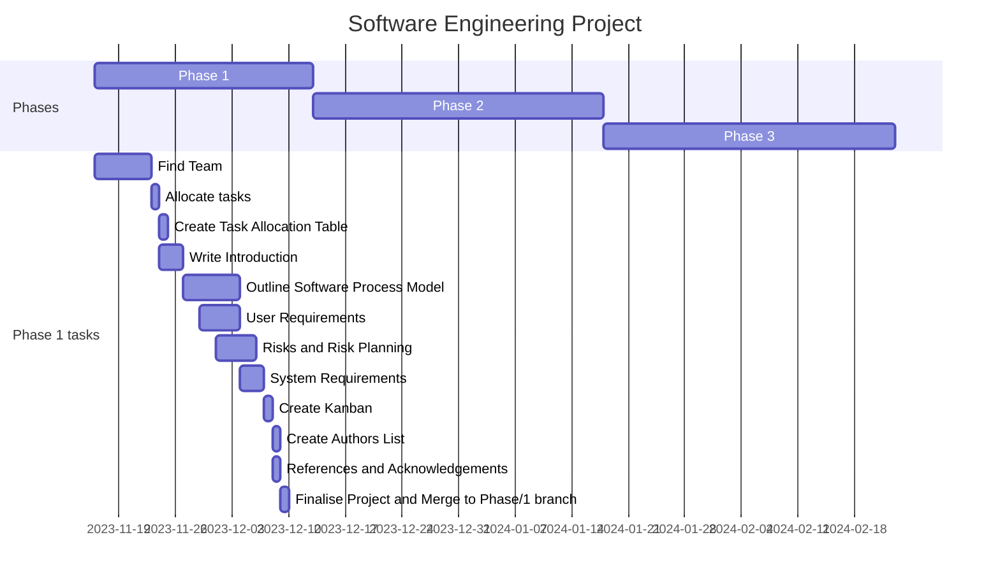

# Phase 1 - Requirements Engineering

## Gantt Chart

The gantt chart is used to aid with the timings of what should be done, and when. This shows the dates of each section graphically, showing how each of the individual elements relate to eachother. This is primarily used for planning purposes, showing how the overall project should go if the the members want it to go efficiently.

## Kanban

The kanban is used as a method of aiding the visualisation of the current events taking place. This is usually a visual method, splitting tasks between three parts: the 'to do' section, the 'in progress' section, and the 'done' or 'completed' sections.

The 'to do' section is the backlog; this part shows the tasks that are yet to be done. This can be used by the team to help decide how when to do each task and who is to do it. The 'in progress' section displays which section is currently being worked on and who is working on it. The final 'completed' section shows which tasks have been finished and by who.

