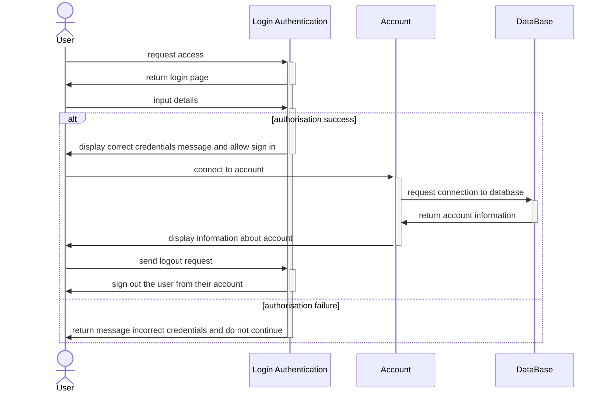
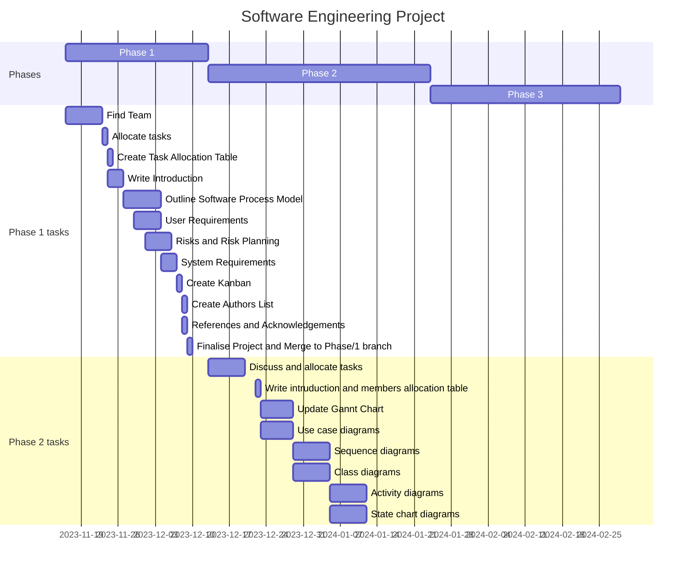

# Phase 2 - System Modelling Design  
  ## Contents
- [Phase 2 - System Modelling Design](#phase-2---system-modelling-design)
  - [Contents](#contents)
  - [Table](#table)
  - [Introduction](#introduction)
  - [Overall System Architecture:](#overall-system-architecture)
  - [Use Case Diagram](#use-case-diagram)
     -[Table Discriptions](#table-Discriptions)
  - [Sequence diagram](#sequence-diagram)
  - [Activity Diagram](#activity-diagram)
  - [State chart diagram](#state-chart-diagram)
- [Appendix](#appendix)
    - [Use Case diagram](#use-case-diagram-1)
    - [Sequence Diagrams](#Sequence-Diagrams-1)
    - [Activity Diagram](#activity-diagram-1)
    - [State Chart diagram](#Sate-Chart-diagram)
    - [Gant Chart](#Gant-Chart)
  - [References and Acknowledgements](#references-and-acknowledgements)

## Table
 
| Name | Assignment |
|-----|-----| 
|[Denis](https://github.com/wheissmd) | Class Diagram 
|[Wojciech](https://github.com/flock-of-jays)| Sequence diagram // Gantt chart 
|[Maisha](https://github.com/maishkhan)|Content // Introduction // Use Case Diagram // Reference  
|[Reshmaa](http://github.com/reshmaa2005)| Table // state chart diagram 
|[Sanjita](http://github.com/SanjiGre99)| Activity diagram // Overall Architecture
## Introduction
The System Modelling and design Phase is an important step in the software development life cycle since it is at this stage that the conceptualised system beings to take shape through comprehensive modelling and design activities.. The goal is to produce a blueprint that will guide the development team in the systems implementation. This report provides a full summary as the modelling and design tasks completed as well as a set of important diagrams that are critical in representing and communicating the systems structure and operation.

**Diagrams and their purpose:**
1.	***Use case Diagrams:***
Use case diagrams represent the relationships between system elements and external actors, emphasising the systems functionality from the user’s point of view. 
    
2.	***Sequence diagram:***
They are used to highlight the dynamic features of a system by illustrating the chronological sequence of interactions between distinct systems components.

3.	***Class diagram:***
This diagram depicts the system’s static structure, emphasising the interaction and dependencies between classes, objects, and their characteristics.

4.	***Activity diagrams:*** 
They are used to show the flow and control of a system by depicting the sequence of activities and decision points. They are especially effective for modelling business processes and workflows.

5.	***State charts diagrams:***
This diagram depicts the various states that an item or system might enter in response to event.

In summary, the accompanying diagrams give a visual depiction of the systems structure, behaviour, and relationships, providing a comprehensive picture that assists both the development team and stakeholders to comprehend and contributing to the systems effective realisation.

## Overall System Architecture:
The architecture of the library system includes a web application that is easy to use and secure, with roles for users and important transactional features including fine payment, return, and borrowing. A relational database is used to manage data storage, and event processing handles important system events as well as user notifications. Security protocols are put into place, including firewall protection and data encryption. It is thought to integrate with external security services and a payment gateway. Tools for analytics and reporting offer insights into the actions of users. Strong security, excellent user experience, scalability, and flexibility are all prioritized in the architecture. 

The architecture of the library system allows for the effective storage of data and facilitates a number of operations, such as collecting fines, conducting inventory searches, and guaranteeing safe logins. Encryption is included into the system for critical events, such as payments and user logins.

## Use Case Diagram
A use case diagram is a visual representation of how multiple actors (users or external systems) interact with a system or software application. It aids in illustrating the many ways in which users or external entities interact with the system to achieve certain objectives or tasks.

**Key components of a use case diagram are:**
1.	***Actors:*** Actors are entities who interact with the system. They may be users, systems of their own, or external entities. In the diagram, performers are show as stick figures or other forms.
2.	***Use cases:*** use cases describe particularly features or actions that the system does to suit the actor’s demand. They are often depicted as ovals and linked to the actors by lines.
3.	***Relationships:*** Lines link actors and use cases. These lines represent the interactions and interdependence of the actors and the system.
4.	***System boundaries:*** The system boundary is a box that contains all the use case ad actors, indicating the scoop of the system being modelled.

Use case diagrams are useful for collecting and visualising a system needs from the perspective of its users. They are frequently used in the early phases of software development to interact with stakeholders’ and offer a high-level overview of the systems capabilities. Use case are frequently used as the foundation for more extensive models and data throughout the software creation procedure.

 ## Table Discriptions 
 

 
 **Table: Register Usecase**
 
| Unit | Depiction |
|------|------| 
|Actors| Students (new Library member)
|Description| Allow new library member to register with the library system.
|Data| Personal information (Title, Full name, Phone number, Email address, Password, Street address, Date of birth, Gender, Notifications, 2-step-varification (authentication))
|Stimulus| User command issued by a new library member.
|Response| Failed to create an account or successfully account created.
|Comments| The System must have appropriate security permissions to access the users data.

**Table: Login Usecase**
 
| Unit | Depiction |
|------|------| 
|Actors| Students (Library member), Librarian (Staff)
|Description| Allows students and staff to securely log into the system. The system authenticates users using their login information (username and password). Users must hae valid and approved profiles to access the sysem. After logging in, users may search for books.
|Data| Users ability (username and password).
|Stimulus| User command issued by a librarian or staff.
|Response| Authentication failed or Successful login.
|Comments| Users have to have legitimate login information and the necessary permissions. To secure user credentials, the system should utilise security techniques like encoding.

**Table: My Account Usecase**
 
| Unit | Depiction |
|------|------| 
|Actors| Student (User)
|Description| Members may check their accounts status, whih includes personal information. checkouts, book holdings, and any penalties incurred. Members can examine their account information to ensure openness. Members may also view payemnt history, accrued penalties, and current fines/blocks in the fine area
|Data| Personal information, Holds and Fines.
|Stimulus| User command issued by a Student (library member)
|Response| Showing Account Details.
|Comments| The System must have appropriate security permissions to access the users data.

**Table: Manage Inventry**
| Unit | Depiction |
|------|------| 
|Actors|  Librarian (Staff)
|Description| Allows the staff member to handle the library's books. This entails introducing new books to the brochure, removing old ones, and updating the catalog's information. The librarian can keep accurate and up-to-date records of all library resources.
|Data| Management of membership, Book information and catalog details.
|Stimulus| User command issued by a librarian or staff.
|Response| Confirmation of book management.
|Comments| Requires permissions that are required along with access for reservation data. The system may iclude funtionality for batch processing, classification, and monitoring of book accessibility.

**Table: Manage Members**
| Unit | Depiction |
|------|------| 
|Actors|  Librarian (Staff)
|Description| Enables the librarian information. This involves adding new members to the system, updating member data, and deleting members as needed. The librarian keeps member records current and up to date.
|Data| Membe details, User information.
|Stimulus| User command issued by a librarian or staff.
|Response| Confirmation of member management actions.
|Comments| Requires correct authorisation and access to user data. The systems may include tools for recording member borrowing history, controlling user roles, and providing notifications to members.

**Table: Return Books**
| Unit | Depiction |
|------|------| 
|Actors|  Librarian (Staff)
|Description| The librarian receives books that library patrons have returned. Each returned book is either scanned or manually entered into the system by the librarian. The system refreshes the catalougue to show that the returned products are now accessible. If a book is returned late, the System generates an overdue punishment based on predetermined guidlines.
|Data| Membe details, book information.
|Stimulus| User command issued by a librarian or staff.
|Response| Confirmation of successful book.
|Comments| Late returns may results in fines, which must be computed according to the return status. The systems should manage fine computations, alerts, and modify the book's current status .

 
## Description
The UML Class diagram is used to represent the static state of the library system as an object oriented system, describing it's structure by showing the classes, their attributes and methods as well as their relationships.
The main abstract class of this system is "Databases" class. It includes two other classes described in the "Phase 1 readme": "Users" and "Books". Both of these classes have a list of attributes that describe the core information about  the objects. "Users" Class is also devided into "Staff" and "Students". "Staff" has an ability to update both the data bases, while "Sudents" are able to borrow books. In order to provide the borrowing system required flexibility and functionality two additional child classes of "Students" exist. They are "History" and "Fees". The "History" class includes all the info about previous book borrowings particular student did with the dates of recieving and returining the book. The "Fees" class features objects that contains the information about current student's fees and the overdue period as well as a method of paying the fee.

## Activity Diagram
An activity diagram shows how a system's activities move and highlights the dynamic elements of a workflow or process. It provides a clear understanding of how various components interact by graphically illustrating the steps, decisions, and concurrent activities involved in carrying out a specific functionality.
The many interactions and procedures that take place inside a library system are described in this activity diagram. Students and staff are the main users in the system, each with different tasks and functions.

**User Login:** 
1.	Authorizes users to log in, starting the process.
2.	Sends the user to the Main Menu after verifying the credentials.

**Main Menu:**
1.	Displays options that are appropriate based on the user type (staff or student).
2.	Book browsing, book rentals, loan management, book returns, and account information checking are all available to students.
3.	The ability to add and remove books, modify book details, and remove users is available to staff.

**Rent Books (Choose Rental Date):**
1.	Students select a rental date when they rent books.
2.	Verifies if the return is late and, if so, determines and applies a late fee that is limited    to the cost of the borrowed books.
3.	Requests that the student pay the late fee.
**Manage Loans:**
1.	Students can manage their current loans, including checking the availability of books.
2.	Staff can edit and delete user details, as well as manage the library's book inventory.

**Return Books:**
1.	Lets students return books to finish the book loan procedure.
**Logout:**
1.	Logs the user out of the system and ends the session.

## State chart diagram 
State chart diagrams are also known as state transition diagrams. In normal terms it just an easy way to explain a process with the help of a diagram, basically a very complicated process could very easily explained to everyone when we use the state chart diagram. This diagram involves the commands and can predict the process with those commands. These commands triggers the possibilities of the process and states it.  
As this is a state diagram lets see about the states it contains: 
 
## Initial state 
The start state or the initial state is represented by a big black dot which automatically represents that the process begins here. These states the particular circumstances or stages that a framework can be in at a given time. Each state depicts a particular way of behaving of the framework and is addressed by a square shape with adjusted corners. For instance, in a traffic signal framework, the states could be "Red," "Yellow," and "Green." 
 
## Event 
This part of the diagram event is the very next state and this predicts neither the action occurs nor it doesn’t and at times it does contains the event parameter which is written within the normal paranthesis which basicaly the normal explanation of the action.  
  
## Arrows 
This the indication that the process is transferred to the next steps and more likely this is the transition in th eprocesses.These represents the difference in state set off by an occasion. Changes are portrayed as bolts interfacing states, demonstrating the stream starting with one state then onto the next in light of occasions. For example, in the traffic signal framework, the change from the "Red" state to the "Green" state might be set off by the occasion of the clock arriving at a specific limit. 
 
## Final state 
This is the end state which will finish the entire process. This is shown with a symbol a black dot surrounded by a thin circle.
 
## In this project:
In this project this state chart diagram starts with the “users”, students and staffs. They first need to login into their account. Then the next step is the “main menu” which contains two choices “Borrow Book” in which the book details are required to avoid the clash and to easily find out if the books are missing. The second one is the “Return Books” there the deadline for the book is highlighted because this will be very easy to charge when they forget to renew before the deadline. Then comes the “Account details” which firstly has the “Fees” column where the current fees which is yet to be paid is shown and secondly comes the “Personal information” section where this specific user’s contact detail such as name, address, phone numbers and even the payment details which is to be paid are displayed. Finally the “Payment” where they just need to click pay and the details will be filled automatically if they are the regular buyers if not the details to be filled and will be auto saved and then click to pay the payment will be done. This sate chart then ends with circular symbol that represents the program's final state at the end of the state chart is covered with another thin circle.  

## Appendix
# Use Case diagram

## Class Diagram

 
# Activity Diagram

# State Chart Diagram

  ## Sequence Diagram

The UML diagram below shows the interaction between the user and a library system when login into their account.

## Diagram description

Sequence diagrams are a type of diagram used to display information about individual system elements and their interactions. These kinds of diagrams are typically abstractions of the overall system and tend not to show any technical details about it. This is to aid any developer in understanding how the system itself should function before implementing it, as well as to show any stakeholders who might not understand specific technical details how the system functions.

## Gantt Chart

A gantt chart displaying the initially planned sequence of events that should take place. The chart itself has been pulled from the phase one branch and updated to also display the activities for phase two.

  
## References and Acknowledgements
1. PlantUML.com. (n.d.). Use case Diagram syntax and features. [online] Available at: https://plantuml.com/use-case-diagram.
2. creately.com. (n.d.). Library Management System | Creately. [online] Available at: https://creately.com/diagram/example/hszw2rmn7/library-management-system.
3. Jain, P. and Dahiya, D. (1970) Architecture of a library management system using gaia extended for multi agent systems, SpringerLink. Available at: https://link.springer.com/chapter/10.1007/978-3-642-19423-8_35 (Accessed: 23 January 2024). 
4. New activity diagram beta syntax and features (no date) PlantUML.com. Available at: https://plantuml.com/activity-diagram-beta (Accessed: 23 January 2024). git 
