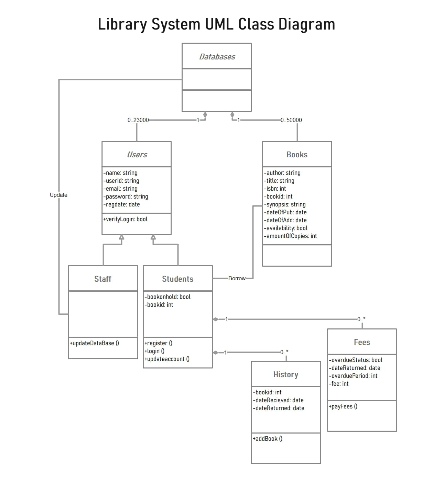

# ELEE1149-Project-Template
## UML Class Diagram

## Description
The UML Class diagram is used to represent the static state of the library system as an object oriented system, describing it's structure by showing the classes, their attributes and methods as well as their relationships.
The main abstract class of this system is "Databases" class. It includes two other classes described in the "Phase 1 readme": "Users" and "Books". Both of these classes have a list of attributes that describe the core information about  the objects. "Users" Class is also devided into "Staff" and "Students". "Staff" has an ability to update both the data bases, while "Sudents" are able to borrow books. In order to provide the borrowing system required flexibility and functionality two additional child classes of "Students" exist. They are "History" and "Fees". The "History" class includes all the info about previous book borrowings particular student did with the dates of recieving and returining the book. The "Fees" class features objects that contains the information about current student's fees and the overdue period as well as a method of paying the fee.