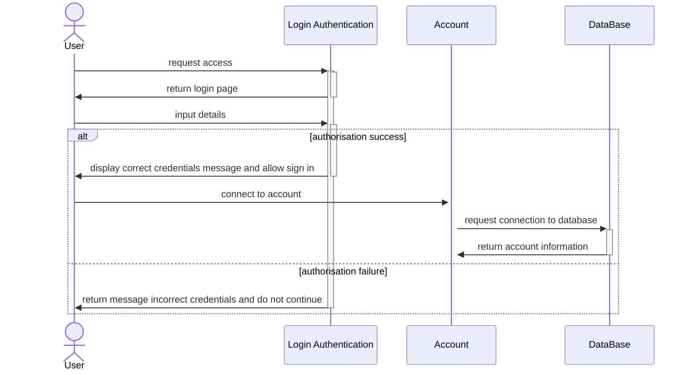
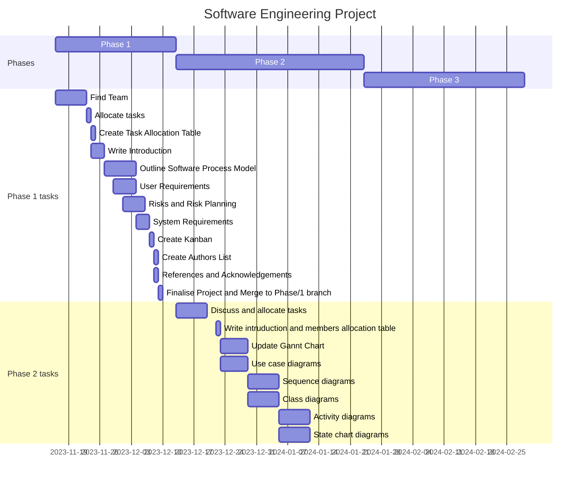

## Sequence Diagram

```mermaid
sequenceDiagram
actor User
User->>+Login Authentication: request access
activate Login Authentication
Login Authentication->>-User: return login page
User->>+Login Authentication: input details
alt authorisation success
Login Authentication->>-User: display correct credentials message and allow sign in
User->>+Account:connect to account
activate Account
Account->>+DataBase:request connection to database
DataBase->>-Account:return account information
else authorisation failure
Login Authentication->>-User: return message incorrect credentials and do not continue
end
```

## Gantt Chart

```mermaid
gantt
title Software Engineering Project
dateFormat DD-MM-YYYY
section Phases
Phase 1:2023-11-16,27d
Phase 2:phase2,2023-12-13,42d
Phase 3:after phase2,36d

section Phase 1 tasks
Find Team:a1,2023-11-16,7d
Allocate tasks:2023-11-23,1d
Create Task Allocation Table:2023-11-24,1d
Write Introduction:a3,2023-11-24,3d
Outline Software Process Model:after a3,7d
User Requirements:2023-11-29,5d
Risks and Risk Planning:2023-12-1,5d
System Requirements:2023-12-4,3d
Create Kanban:2023-12-07,1d
Create Authors List:2023-12-08,1d
References and Acknowledgements:a4,2023-12-08,1d
Finalise Project and Merge to Phase/1 branch:after a4,1d

section Phase 2 tasks
Discuss and allocate tasks:2023-12-13,7d
Write intruduction and members allocation table:a1,2023-12-22,1d
Update Gannt Chart:after a1,6d
Use case diagrams:after a1,6d
Sequence diagrams:a2,2023-12-29,7d
Class diagrams:2023-12-29,7d
Activity diagrams:after a2,7d
State chart diagrams:after a2,7d
```