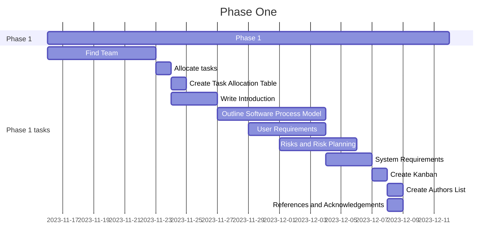

## Gantt Chart

```mermaid
gantt
title Phase One
dateFormat DD-MM-YYYY
section Phase 1
Phase 1:a1,2023-11-16,26d

section Phase 1 tasks
Find Team:a1,2023-11-16,7d
Allocate tasks:a2,2023-11-23,1d
Create Task Allocation Table:after a2,1d
Write Introduction:a3,2023-11-24,3d
Outline Software Process Model:after a3,7d
User Requirements:2023-11-29,5d
Risks and Risk Planning:2023-12-1,5d
System Requirements:2023-12-4,3d
Create Kanban:2023-12-07,1d
Create Authors List:2023-12-08,1d
References and Acknowledgements:2023-12-08,1d
```

## Kanban

Screenshot of the kanban while the project was in progress
