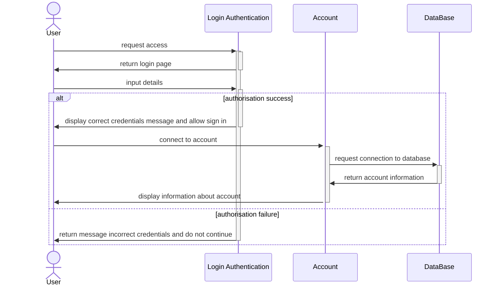

## Sequence Diagram

Sequence diagrams are a type of diagram used to display information about individual system elements and their interactions. These kinds of diagrams are typically abstractions of the overall system and tend not to show any technical details about it. This is to aid any developer in understanding how the system itself should function before implementing it, as well as to show any stakeholders who might not understand specific technical details how the system functions.

The diagram below shows the interaction between the user and a library system when loggin in and managing accounts.

## Gantt Chart

A gantt chart displaying the initially planned sequence of events that should take place.

